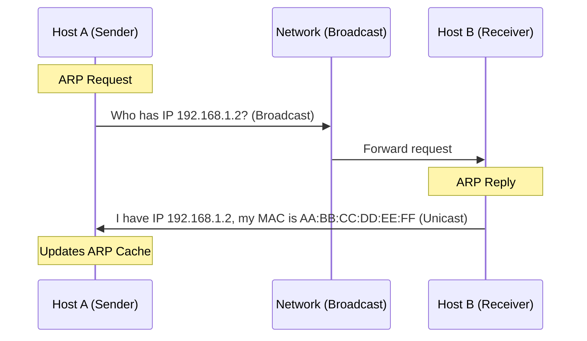
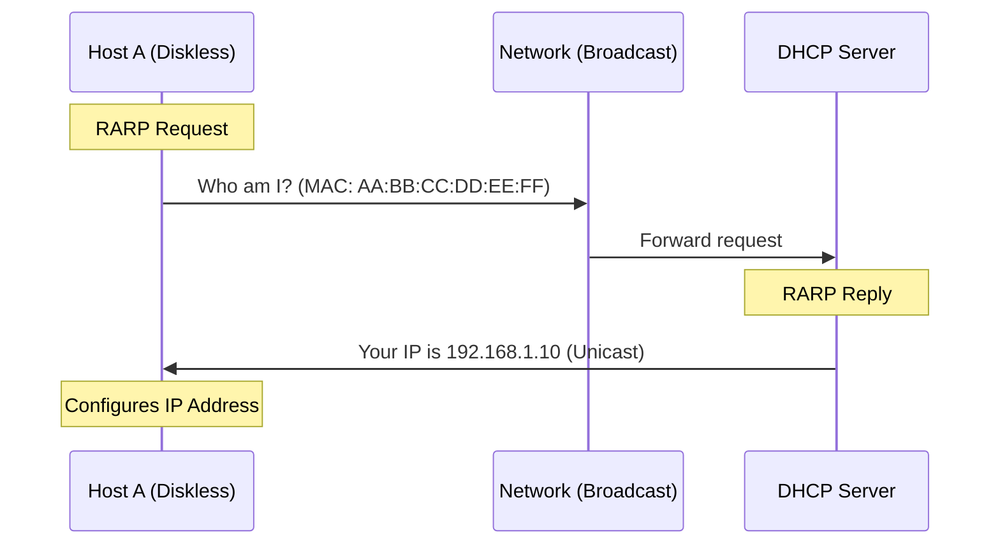
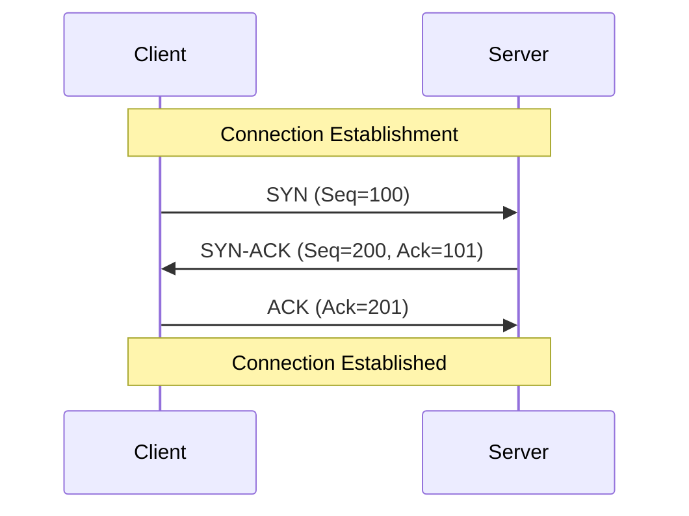
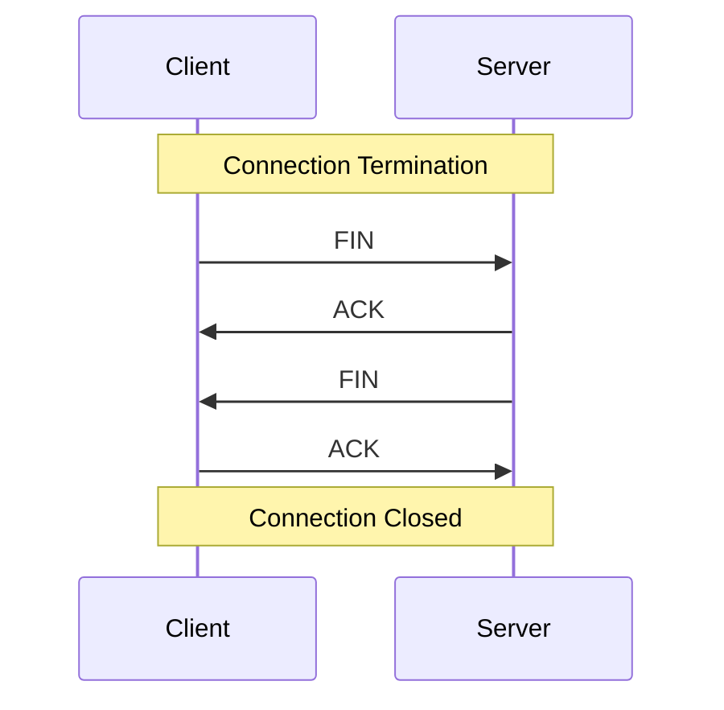
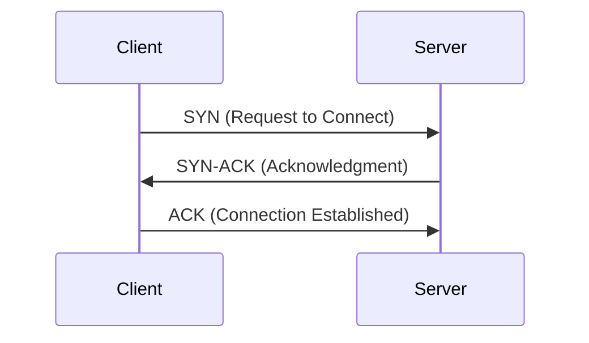
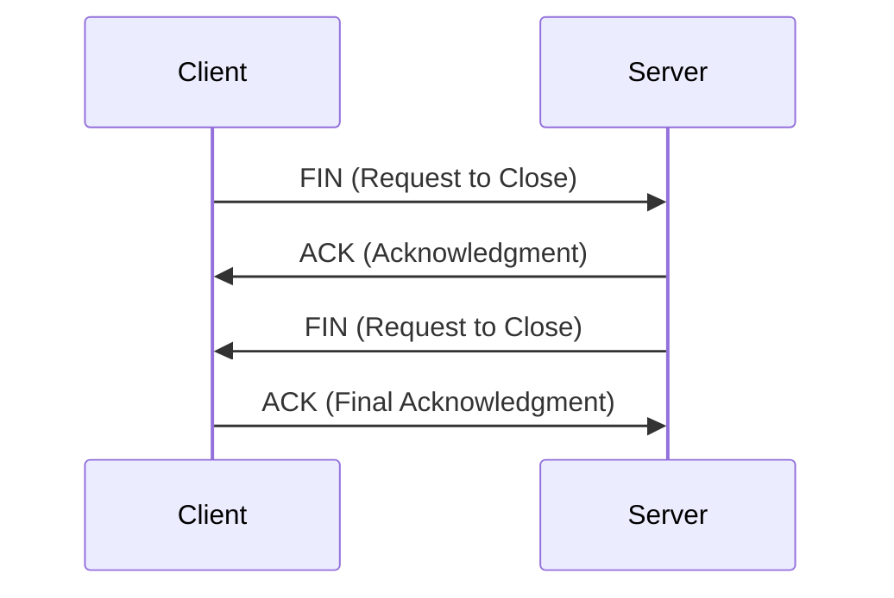
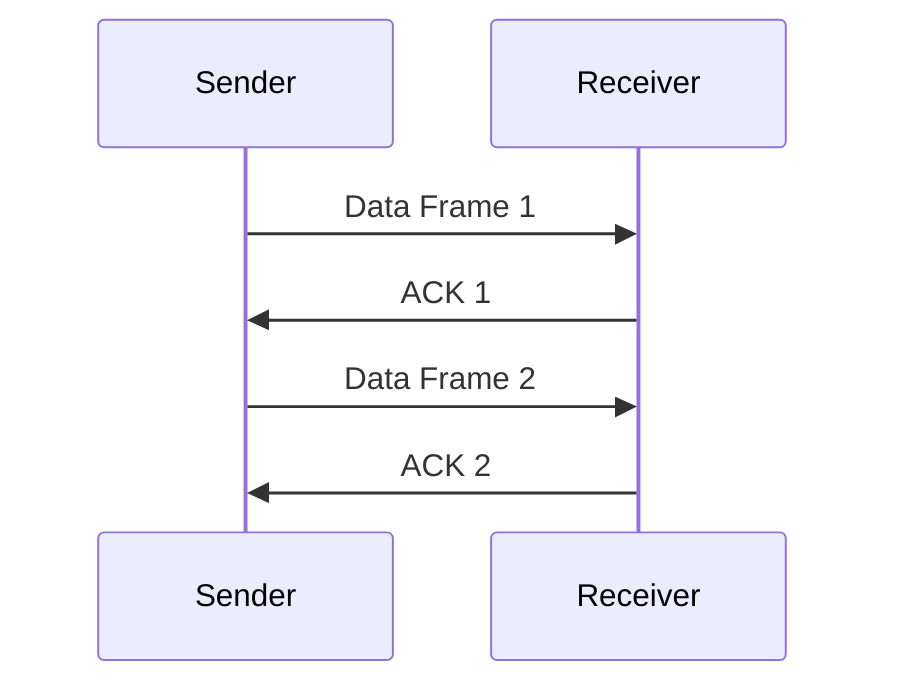
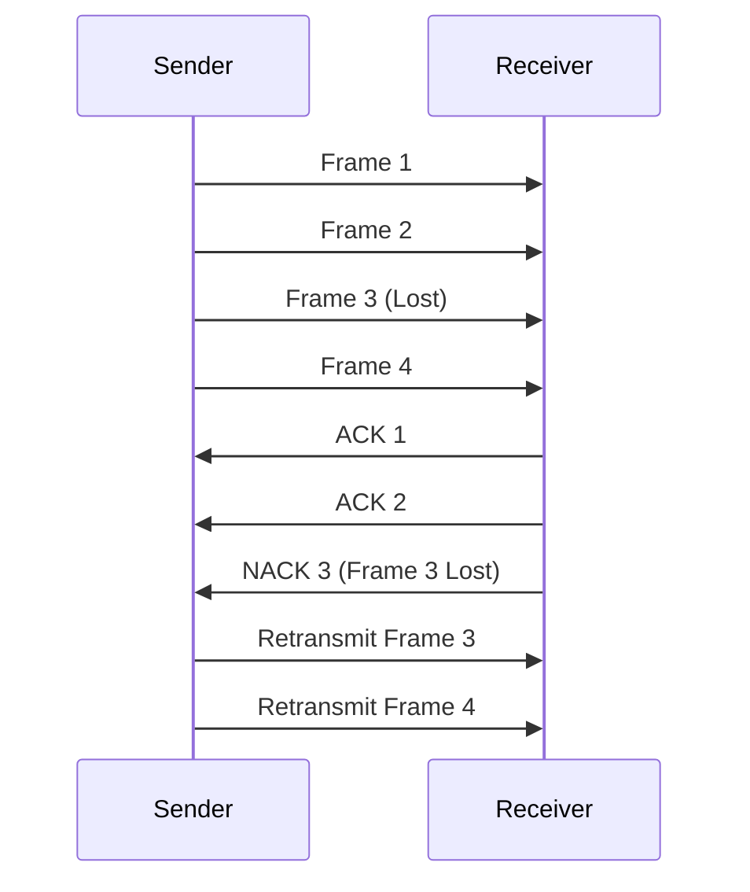
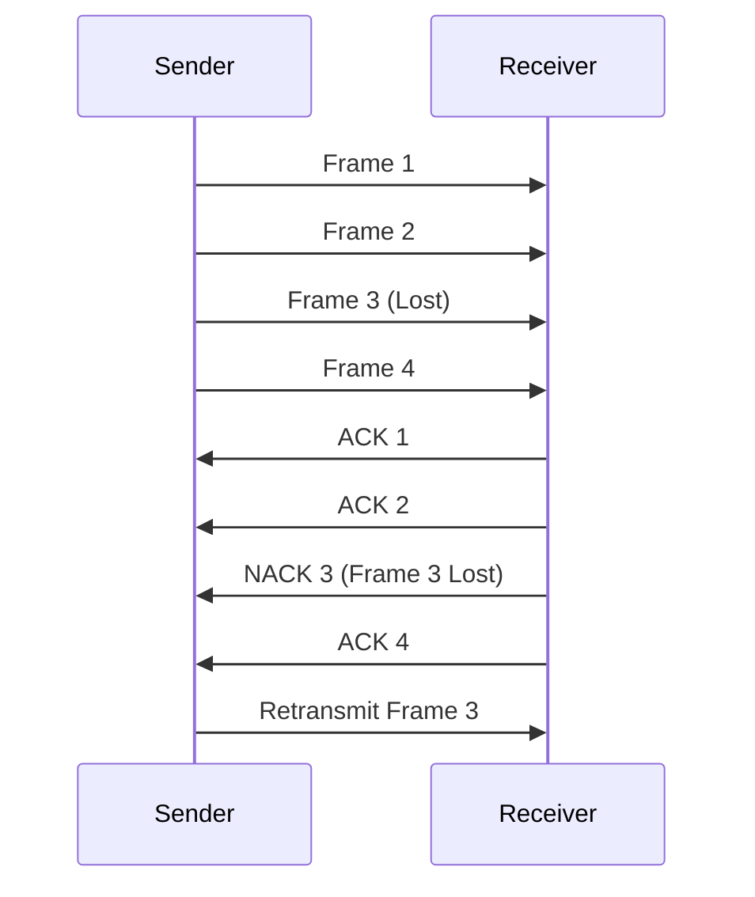
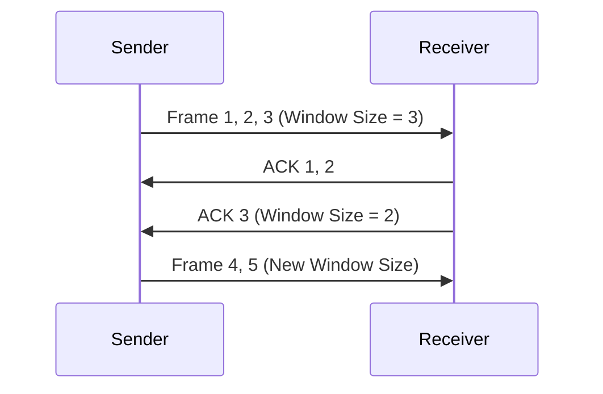

# **Suggestions**

---

# **Short Questions**

### **Module 1: Web and Internet Technology**  

**What is the World Wide Web?**  
The World Wide Web (WWW) is a system of interlinked web pages accessible through the internet using browsers.  

**Define URL and its components.**  
A URL (Uniform Resource Locator) is the address of a web resource. It consists of a protocol (`https://`), domain name (`example.com`), path (`/page`), and query parameters (`?id=1`).  

**What is DNS and how does it work?**  
DNS (Domain Name System) translates domain names into IP addresses, allowing browsers to locate and access websites.  

**What is the purpose of FTP?**  
FTP (File Transfer Protocol) is used for transferring files between a client and a server over a network.  

**Differentiate between ARP and RARP.**  
ARP (Address Resolution Protocol) converts an IP address to a MAC address, while RARP (Reverse ARP) converts a MAC address to an IP address.  

**Explain TCP and its function in networking.**  
TCP (Transmission Control Protocol) ensures reliable, ordered, and error-free data transmission over a network.  

**What is flow control in TCP?**  
Flow control prevents data loss by regulating the rate of data transmission using protocols like sliding window and stop-and-wait.  

**Differentiate between Intranet, Extranet, and Internet.**  
Intranet is a private network for internal users, Extranet allows controlled access to external partners, and the Internet is a global network accessible to everyone.  

---

### **Module 2: HTML and Web Development**  

**What is HTML?**  
HTML (HyperText Markup Language) is the standard language for structuring and displaying content on the web.  

**Describe the basic structure of an HTML document.**  
```html
<!DOCTYPE html>
<html>
<head>
    <title>Title</title>
</head>
<body>
    <h1>Heading</h1>
    <p>Paragraph.</p>
</body>
</html>
```  

**List advantages and disadvantages of HTML.**  
HTML is easy to learn, compatible with all browsers, and does not require software installation. However, it only supports static pages and requires CSS and JavaScript for styling and functionality.  

**Explain `<h1>` to `<h6>` tags.**  
These tags define headings, where `<h1>` is the largest and `<h6>` is the smallest.  

**What is the purpose of the `<p>` tag?**  
The `<p>` tag defines paragraphs in an HTML document.  

**Differentiate between `<br>` and `<div>`.**  
`<br>` inserts a line break, while `<div>` is a container for grouping elements and applying styles.  

**What is the function of `<sub>` and `<sup>`?**  
`<sub>` displays subscript text (H₂O), while `<sup>` displays superscript text (x²).  

**How does the `<pre>` tag work?**  
The `<pre>` tag preserves formatting, displaying text as written in the HTML file.  

**Differentiate between `<big>` and `<small>`.**  
`<big>` increases text size (deprecated in HTML5), while `<small>` decreases text size.  

**What is the purpose of the `<i>` tag?**  
The `<i>` tag italicizes text.  

**Explain the `` tag and its attributes.**  
The `` tag embeds images. Example:  
```html

```  

**What is the function of `<a>` and `href`?**  
The `<a>` tag creates hyperlinks. Example:  
```html
<a href="https://example.com">Click Here</a>
```  

**How can CSS be added to an HTML document?**  
CSS can be added as inline styles, internal styles in the `<head>`, or as an external stylesheet linked with `<link>`.  

**Differentiate between inline, internal, and external CSS.**  
Inline CSS applies styles within elements, internal CSS is written inside `<style>` in `<head>`, and external CSS is in a separate `.css` file linked to the HTML.  

**List ways to include JavaScript in an HTML document.**  
JavaScript can be added inline using event attributes, internally within `<script>` tags, or externally by linking a `.js` file.  

**Explain the advantages of external CSS and JavaScript.**  
External CSS and JavaScript improve maintainability, enhance page speed, and keep HTML clean.  

**How is an external CSS file linked in HTML?**  
```html
<link rel="stylesheet" href="style.css">
```  

**What is the purpose of the `<script>` tag?**  
The `<script>` tag embeds JavaScript in an HTML document.  

**How do you change an element’s color using JavaScript?**  
```js
document.getElementById("text").style.color = "red";
```  

**What is `document.getElementById()` used for?**  
It selects an HTML element by its `id` to manipulate it using JavaScript.  

---

# **OSI Model and TCP/IP Model**

## **1. OSI Model (Open Systems Interconnection)**
The OSI model is a **theoretical framework** for understanding network communication, divided into **7 layers**.

| **Layer** | **Function** | **Protocols & Examples** |
|-----------|-------------|--------------------------|
| **7. Application** | Provides network services to applications. | HTTP, FTP, SMTP, POP3, DNS |
| **6. Presentation** | Data translation, encryption, and compression. | JPEG, MP3, ASCII, TLS, SSL |
| **5. Session** | Manages sessions between applications. | NetBIOS, RPC, PPTP |
| **4. Transport** | Ensures reliable data transfer (segmentation, flow control, error control). | TCP, UDP |
| **3. Network** | Determines path selection (routing) and logical addressing. | IP, ICMP, RIP, OSPF |
| **2. Data Link** | Error detection, MAC addressing, framing. | Ethernet, Wi-Fi, PPP, ARP, MAC |
| **1. Physical** | Transmission of raw data bits over media. | Cables, Radio signals, Fiber optics |

### **Key Features of OSI Model**
- **Layered approach:** Each layer performs a specific function.
- **Encapsulation:** Data passes through layers, with headers added/removed.
- **Standardization:** Provides interoperability across vendors.

---

## **2. TCP/IP Model**
The **TCP/IP model** is a **practical networking model** used for the Internet. It has **4 layers**, combining some OSI layers.

| **Layer** | **Function** | **Corresponding OSI Layers** | **Protocols & Examples** |
|-----------|-------------|------------------------------|--------------------------|
| **4. Application** | End-user communication. | Application, Presentation, Session | HTTP, FTP, SMTP, DNS |
| **3. Transport** | Reliable/unreliable data delivery. | Transport | TCP, UDP |
| **2. Internet** | Logical addressing, routing. | Network | IP, ICMP, ARP, RIP, OSPF |
| **1. Network Access** | Physical transmission and MAC addressing. | Data Link, Physical | Ethernet, Wi-Fi, PPP |

### **Key Features of TCP/IP Model**
- **Practical & simpler than OSI.**
- **Protocol-driven:** Defines real-world communication protocols.
- **End-to-end communication:** Designed for the Internet.

---

## **3. Comparison: OSI vs. TCP/IP**

| **Aspect** | **OSI Model** | **TCP/IP Model** |
|------------|--------------|------------------|
| **Structure** | 7 layers | 4 layers |
| **Developed by** | ISO (International Organization for Standardization) | DARPA (Defense Advanced Research Projects Agency) |
| **Usage** | Theoretical framework | Real-world implementation |
| **Protocol Binding** | Independent of specific protocols | Tightly bound to TCP/IP protocols |
| **Flexibility** | More flexible, separate layers | More rigid, combines functions |

---

## **4. Exam Preparation Notes**
- **Know OSI layers and their functions.**
- **Understand how TCP/IP maps to OSI layers.**
- **Memorize key protocols used at each layer.**
- **Compare OSI and TCP/IP models.**
- **Understand encapsulation and de-encapsulation.**
- **Be ready to explain flow control, error control, routing.**

---
---

# **Error Checking in Networking**

## **1. Types of Errors in Data Transmission**
Errors occur due to **noise, interference, or hardware failures** in transmission channels. The two main types are:  

- **Single-bit error:** Only **one** bit is altered.  
- **Burst error:** **Multiple bits** are altered, usually due to interference.  

## **2. Error Checking vs. Error Correction**
| **Aspect**  | **Error Checking** | **Error Correction** |
|------------|------------------|------------------|
| **Purpose** | Detects errors in transmitted data | Detects and corrects errors |
| **Action Taken** | Requests retransmission if errors are found | Corrects errors using redundant information |
| **Methods Used** | Parity Check, Checksum, CRC | Hamming Code, Reed-Solomon Code, Forward Error Correction (FEC) |

---

## **3. Error Detection Techniques**
### **(a) Parity Check**
- Adds a **parity bit** to data:  
  - **Even Parity**: Total **1s** in data + parity bit = **even**  
  - **Odd Parity**: Total **1s** in data + parity bit = **odd**  
- Simple but **cannot detect burst errors**.

### **(b) Checksum**
- Used in **TCP, UDP, and IP headers**.  
- Data is divided into **fixed-length blocks**, summed up, and stored as a **checksum value**.  
- Receiver **recalculates checksum** and compares it with the received one.  
- **Efficient but may miss some errors.**

### **(c) Cyclic Redundancy Check (CRC)**
- Used in **Ethernet, Wi-Fi, and HDLC**.  
- Treats data as a **polynomial** and divides it by a fixed **generator polynomial**.  
- The remainder (CRC code) is appended to the data.  
- **Highly effective for burst errors.**

---

## **4. Error Correction Techniques**
### **(a) Hamming Code**
- Adds **extra bits (parity bits)** to detect and correct **single-bit errors**.  
- Uses **Hamming Distance**: Minimum number of bit flips required to convert one valid code to another.  
- **Used in RAM and satellite communications.**

### **(b) Reed-Solomon Code**
- Used in **CDs, DVDs, and QR codes**.  
- Divides data into **blocks** and adds **error correction bits**.  
- Can correct **multiple errors per block**.

### **(c) Forward Error Correction (FEC)**
- Used in **real-time applications** like VoIP and video streaming.  
- **No retransmission** needed—errors are corrected at the receiver.  
- Example: **Convolutional Codes, Turbo Codes**.

---

## **5. Error Checking at Different OSI Layers**
| **Layer** | **Error Checking Method** |
|-----------|---------------------------|
| **Physical** | No error checking, relies on hardware |
| **Data Link** | CRC (Ethernet, Wi-Fi), Checksum |
| **Network** | Checksum (IPv4 Header) |
| **Transport** | TCP Checksum, UDP Checksum |
| **Application** | Application-specific validation (e.g., TLS integrity checks) |

---

## **6. Summary for Exam Preparation**
- Understand **error detection vs. error correction**.  
- Learn the working of **parity, checksum, CRC, Hamming Code, and FEC**.  
- Know which **protocols** use each method (e.g., **TCP, UDP, Ethernet, Wi-Fi**).  
- Be able to **calculate CRC and Hamming Code manually**.  

---
---

# **Inter, Intra, and Extranet**  

## **1. Internet**  
The **Internet** is a **global network** connecting millions of private, public, academic, business, and government networks. It uses the **TCP/IP protocol suite** to enable communication between devices worldwide.  

### **Characteristics**  
- **Publicly accessible** to anyone with an internet connection.  
- Uses **IP addresses and DNS** for identifying devices.  
- Supports services like **email, websites, cloud computing, VoIP, and online gaming**.  
- **Security concerns** due to public access (requires firewalls, encryption, VPNs).  

### **Example**  
- Browsing websites like **Google, Facebook, or YouTube**.  
- Sending an **email via Gmail or Outlook**.  
- Accessing **cloud storage (Google Drive, OneDrive, AWS S3)**.  

---

## **2. Intranet**  
An **Intranet** is a **private network** used within an organization to securely share data, applications, and resources among employees. It is **not accessible** from outside unless connected via a **VPN** or special access controls.  

### **Characteristics**  
- **Restricted access**: Only authorized employees or members can access it.  
- Uses **web technologies** like HTTP, FTP, and email, but within a private network.  
- Helps in **collaboration, document sharing, and internal communication**.  
- More **secure** than the internet, as it is controlled internally.  

### **Example**  
- A company’s **HR portal** for employee records and payroll.  
- **Internal communication platforms** (e.g., Microsoft SharePoint, Slack for internal use).  
- **University portals** for students and faculty members.  

---

## **3. Extranet**  
An **Extranet** is an **extension of an Intranet** that allows controlled **external access** to specific users, such as **business partners, vendors, or clients**. It combines the security of an Intranet with **limited external connectivity**.  

### **Characteristics**  
- **Controlled external access**: Requires authentication (passwords, VPN, firewalls).  
- Allows **secure collaboration** with third parties.  
- Typically used for **B2B (Business-to-Business) communication**.  

### **Example**  
- A **supplier portal** where vendors track product shipments.  
- A **bank’s secure portal** for corporate clients to manage transactions.  
- A **customer service dashboard** where clients check support tickets.  

---

## **Comparison Table**  
| **Feature**  | **Internet** | **Intranet** | **Extranet** |
|-------------|------------|------------|------------|
| **Access** | Public | Private (internal users) | Private (internal + external users) |
| **Security** | Low (public access) | High (restricted) | Medium (controlled external access) |
| **Users** | Anyone worldwide | Employees, students, members | Business partners, suppliers, select clients |
| **Usage** | Websites, emails, cloud | Internal communication, HR, file sharing | B2B collaboration, supplier/vendor portals |
| **Example** | Google, Facebook, Wikipedia | Company HR portal, university website for staff | Supplier access to a company's inventory system |

---

## **Key Takeaways for Exams**  
- **Internet** = **Global** public network (open to all).  
- **Intranet** = **Private** network for internal use.  
- **Extranet** = **Intranet + limited external access** for partners/clients.  
- **Security levels**: **Internet (Low) < Extranet (Medium) < Intranet (High)**.  

---
---

# **World Wide Web (WWW)**  

## **Definition**  
The **World Wide Web (WWW)** is a **system of interlinked hypertext documents** accessible via the **Internet**. It allows users to **view web pages** using a **web browser** by following hyperlinks.  

## **Key Components**  
### **1. Web Pages & Websites**  
- A **web page** is a document (usually written in HTML) that is displayed in a web browser.  
- A **website** is a collection of related web pages hosted on a web server.  

### **2. URLs (Uniform Resource Locators)**  
- A **URL** is the unique address of a web page (e.g., `https://www.google.com`).  
- It consists of:  
  - **Protocol** (e.g., HTTP, HTTPS)  
  - **Domain name** (e.g., google.com)  
  - **Path** (e.g., `/search`)  

### **3. HTTP & HTTPS (Protocols)**  
- **HTTP (Hypertext Transfer Protocol)**: Standard protocol for web communication.  
- **HTTPS (Secure HTTP)**: Encrypted version of HTTP using SSL/TLS for security.  

### **4. Web Browsers**  
- Software used to access the WWW (e.g., Chrome, Firefox, Edge, Safari).  
- Retrieves web pages from servers and displays them to users.  

### **5. Web Servers**  
- Hosts web pages and delivers them to users upon request.  
- Examples: Apache, Nginx, Microsoft IIS.  

### **6. Hyperlinks**  
- Allow users to **navigate** between web pages using clickable links.  
- `<a href="https://www.example.com">Click Here</a>` is an example of a hyperlink.  

## **How WWW Works?**  
1. **User enters a URL** in a web browser.  
2. **Browser sends an HTTP/HTTPS request** to the web server.  
3. **Web server processes the request** and returns the web page.  
4. **Browser renders the page** and displays it to the user.  

## **Relation Between WWW and Internet**  
- The **Internet** is the **physical network** (global infrastructure).  
- The **WWW** is a **service running on the Internet** to access web pages.  

## **Comparison Table: WWW vs. Internet**  

| Feature | **WWW** | **Internet** |
|---------|--------|-------------|
| Definition | A system of interlinked web pages | A global network of interconnected computers |
| Function | Provides access to web content | Enables communication between devices |
| Protocols Used | HTTP, HTTPS | TCP/IP, FTP, SMTP, DNS, etc. |
| Example | Google, Wikipedia, Facebook | Email, cloud storage, file sharing |

---
---

# **Uniform Resource Locator (URL)**  

## **Definition**  
A **Uniform Resource Locator (URL)** is a reference or address used to access resources on the **World Wide Web (WWW)**. It specifies the **location of a resource** and the **protocol** used to retrieve it.  

Example:  
```
https://www.example.com/path/page.html
```

## **Structure of a URL**  
A URL consists of several components:  

| Component | Description | Example |
|-----------|------------|---------|
| **Protocol (Scheme)** | Specifies the method used to access the resource | `https://` |
| **Domain Name** | Identifies the web server hosting the resource | `www.example.com` |
| **Port (Optional)** | Defines the communication port (default: 80 for HTTP, 443 for HTTPS) | `:443` |
| **Path** | Specifies the location of the resource on the server | `/path/page.html` |
| **Query String (Optional)** | Contains parameters sent to the server | `?id=10&name=test` |
| **Fragment (Optional)** | Points to a section within a web page | `#section1` |

### **Example Breakdown**  
URL:  
```
https://www.example.com:443/products/item.html?id=123#reviews
```
| Component | Value |
|-----------|-------|
| Protocol | `https://` |
| Domain Name | `www.example.com` |
| Port | `443` (default for HTTPS) |
| Path | `/products/item.html` |
| Query String | `?id=123` |
| Fragment | `#reviews` |

## **Types of URLs**  
1. **Absolute URL**  
   - Contains the full address of a resource.  
   - Example: `https://www.example.com/docs/index.html`  
   
2. **Relative URL**  
   - Specifies a path relative to the current location.  
   - Example: `/docs/index.html` (used within the same website).  

## **Common URL Protocols**  
| Protocol | Purpose |
|----------|---------|
| **HTTP** | Web page access (non-secure) |
| **HTTPS** | Secure web page access |
| **FTP** | File transfer |
| **mailto** | Email links |
| **tel** | Phone call links |
| **file** | Access local files |

---
---

# **Domain Name System (DNS)**  

## **Definition**  
The **Domain Name System (DNS)** is a hierarchical system that translates **human-readable domain names** (e.g., `www.example.com`) into **IP addresses** (e.g., `192.168.1.1`), which computers use to locate each other on the internet.

## **Why DNS is Needed?**  
- Humans remember domain names **(e.g., google.com)** more easily than **IP addresses**.  
- DNS **automates** the process of finding the IP address linked to a domain.  
- It allows websites to change their **IP addresses** without affecting users.

## **How DNS Works?**  
1. A user enters `www.example.com` in a web browser.  
2. The browser checks the **cache** (local memory or ISP cache) for the IP address.  
3. If not found, a **DNS query** is sent to a **DNS resolver** (provided by the ISP).  
4. The resolver queries the **root DNS server**, which directs it to a **TLD (Top-Level Domain) server** (e.g., `.com`).  
5. The TLD server directs it to the **authoritative DNS server** for `example.com`.  
6. The authoritative DNS server returns the **IP address** of `www.example.com`.  
7. The browser uses the IP address to request the web page from the web server.

## **DNS Hierarchy**  
DNS follows a **hierarchical structure**:  

| Level | Example | Role |
|-------|---------|------|
| **Root DNS Server** | `.` (dot) | Directs queries to TLD servers |
| **Top-Level Domain (TLD) Server** | `.com`, `.org`, `.net` | Manages domains under a TLD |
| **Authoritative DNS Server** | `example.com` | Stores actual IP address of the domain |

## **Types of DNS Servers**  
1. **Recursive Resolver** – Queries DNS records on behalf of clients.  
2. **Root DNS Server** – First level of the DNS hierarchy.  
3. **TLD DNS Server** – Manages TLDs like `.com`, `.org`.  
4. **Authoritative DNS Server** – Stores actual domain-to-IP mappings.

## **Types of DNS Records**  
| Record Type | Purpose | Example |
|------------|---------|---------|
| **A Record** | Maps domain to IPv4 address | `example.com → 192.168.1.1` |
| **AAAA Record** | Maps domain to IPv6 address | `example.com → 2001:db8::1` |
| **CNAME Record** | Alias for another domain | `www.example.com → example.com` |
| **MX Record** | Mail server for a domain | `example.com → mail.example.com` |
| **TXT Record** | Stores arbitrary text data | Used for security (SPF, DKIM) |

## **DNS Caching**  
- DNS responses are cached to **speed up** future requests.  
- Caching occurs at multiple levels:  
  - **Local device cache** (browser, OS).  
  - **ISP cache** (recursive resolver).  
  - **Server-side cache** (CDN, proxy servers).  

---
---

# **File Transfer Protocol (FTP)**  

## **Definition**  
**File Transfer Protocol (FTP)** is a standard network protocol used to transfer files between a **client** and a **server** over a **TCP/IP network**. It enables users to upload, download, and manage files on remote servers.

## **How FTP Works?**  
1. A client connects to an **FTP server** using an **FTP client application** (e.g., FileZilla).  
2. The user **authenticates** with a username and password (or via **anonymous FTP** if allowed).  
3. The client can **upload, download, delete, rename, or list files** on the server.  
4. The connection is closed when the session ends.

## **FTP Modes**  
FTP operates in two modes:  

| Mode | Description |
|------|------------|
| **Active Mode** | The client opens a **random port** and informs the server. The server then connects to the client’s port. |
| **Passive Mode** | The server opens a port, and the client **initiates** the connection. Used in cases where firewalls block incoming connections. |

## **FTP Commands**  
| Command | Description |
|---------|------------|
| `USER` | Provides the username for login |
| `PASS` | Provides the password for authentication |
| `LIST` | Lists directory contents |
| `RETR` | Downloads a file from the server |
| `STOR` | Uploads a file to the server |
| `DELE` | Deletes a file from the server |
| `QUIT` | Ends the FTP session |

## **Types of FTP Connections**  
1. **Anonymous FTP** – Allows public access without authentication.  
2. **Authenticated FTP** – Requires a username and password.  
3. **Secure FTP (SFTP)** – Uses **SSH encryption** for secure file transfers.  
4. **FTPS (FTP Secure)** – Uses **SSL/TLS encryption** for secure transfers.

## **Advantages of FTP**  
✔ Efficient for **large file transfers**  
✔ Supports **resume functionality** for interrupted downloads  
✔ Can be automated using scripts  

## **Disadvantages of FTP**  
✘ **Unencrypted** in basic FTP (data can be intercepted)  
✘ Requires **firewall configuration** for active mode  
✘ Slower than modern alternatives like **HTTP(S)** or **cloud storage**  

---
---

# **Address Resolution Protocol (ARP) and Reverse ARP (RARP)**  

## **Definition**  
The **Address Resolution Protocol (ARP)** is a network protocol used to map an **IP address** to a corresponding **MAC (Media Access Control) address** within a **local network (LAN)**. It allows devices to communicate over Ethernet by finding the hardware address of a host using its IP address.  

The **Reverse Address Resolution Protocol (RARP)** is used to find an **IP address** when a device only knows its **MAC address**. It is primarily used by diskless workstations to obtain an IP address from a server.

## **How ARP Works?**  
1. A device wants to send data to an IP address within the same network.  
2. It checks its **ARP cache** to see if the MAC address for that IP is already stored.  
3. If not found, it sends an **ARP Request (broadcast message)** asking **"Who has this IP address?"**  
4. The device with the matching IP responds with an **ARP Reply (unicast message)** providing its MAC address.  
5. The sender updates its **ARP cache** and sends the data.  

### **ARP Request & Reply (Diagram)**  


## **Types of ARP Messages**  
| Type | Description |
|------|------------|
| **ARP Request** | Broadcast message asking for a MAC address. |
| **ARP Reply** | Unicast response containing the requested MAC address. |
| **Reverse ARP (RARP)** | Resolves a **MAC address** to an **IP address** (used in older systems). |
| **Gratuitous ARP (GARP)** | Announced by a device to update the ARP cache of other devices. |
| **Proxy ARP** | A router responds to ARP requests on behalf of another device. |

## **ARP Cache**  
- Each device maintains an **ARP cache** to store IP-to-MAC mappings.  
- Entries are **temporary** and expire after a set time.  
- The `arp -a` command (on Windows/Linux) displays the ARP cache.

## **How RARP Works?**  
1. A diskless device boots up with only its **MAC address**.  
2. It sends a **RARP Request** asking for its IP address.  
3. A **RARP Server** (such as a DHCP server) looks up the MAC address and assigns an IP.  
4. The server sends a **RARP Reply** providing the IP address.  
5. The device configures itself with the assigned IP.  

### **RARP Request & Reply (Diagram)**  


## **ARP Spoofing (Security Risk)**  
Attackers can send fake ARP replies, tricking devices into associating the wrong MAC address with an IP, enabling **Man-in-the-Middle (MITM) attacks**.

## **ARP vs. RARP**  
| Feature | ARP | RARP |
|---------|-----|------|
| Resolves | IP → MAC | MAC → IP |
| Used by | Hosts in LAN | Diskless devices |
| Purpose | Find MAC address for communication | Obtain an IP address when none is configured |

---
---

# **Transmission Control Protocol (TCP) and Three-Way Handshake**  

## **Definition**  
The **Transmission Control Protocol (TCP)** is a **connection-oriented, reliable** transport layer protocol that ensures ordered and error-checked data transmission between devices. It establishes a **virtual connection** before data transfer using a mechanism called the **Three-Way Handshake**.

## **TCP Features**  
- **Reliable Delivery** – Ensures all data is received without loss.  
- **Connection-Oriented** – Requires an established connection before communication.  
- **Error Checking** – Uses checksums and acknowledgments (ACKs).  
- **Flow Control** – Manages data rate between sender and receiver.  
- **Congestion Control** – Prevents excessive data from overwhelming the network.  
- **Ordered Delivery** – Ensures data arrives in sequence using sequence numbers.

---

## **TCP Three-Way Handshake**  
The **Three-Way Handshake** is a process used to establish a reliable connection between a client and a server.

### **Steps in the Handshake**  
1. **SYN (Synchronize)**: The client initiates a connection by sending a **SYN** packet to the server.  
2. **SYN-ACK (Synchronize-Acknowledge)**: The server responds with a **SYN-ACK**, acknowledging the request.  
3. **ACK (Acknowledge)**: The client sends a final **ACK**, confirming the connection.  

After this process, the connection is established, and data transfer begins.

### **Three-Way Handshake (Diagram)**  


---

## **TCP Connection Termination (Four-Way Handshake)**  
To **terminate** a TCP connection, a **Four-Way Handshake** is used:  

1. **FIN** – The client requests to close the connection by sending a **FIN** packet.  
2. **ACK** – The server acknowledges the request.  
3. **FIN** – The server also sends a **FIN** when it's ready to close.  
4. **ACK** – The client acknowledges and closes the connection.  

### **Connection Termination (Diagram)**  


---

## **TCP Header Structure**  
| **Field** | **Description** |
|-----------|---------------|
| **Source Port** | Identifies the sending port. |
| **Destination Port** | Identifies the receiving port. |
| **Sequence Number** | Tracks the order of sent packets. |
| **Acknowledgment Number** | Confirms received packets. |
| **Flags** | Includes SYN, ACK, FIN, etc. |
| **Window Size** | Controls flow of data. |
| **Checksum** | Ensures data integrity. |

---

## **TCP vs. UDP**  
| Feature | TCP (Transmission Control Protocol) | UDP (User Datagram Protocol) |
|---------|---------------------------------|-------------------------------|
| **Connection Type** | Connection-oriented | Connectionless |
| **Reliability** | Reliable | Unreliable |
| **Error Checking** | Uses checksums and retransmission | Uses checksums, but no retransmission |
| **Speed** | Slower (due to handshaking) | Faster |
| **Use Cases** | Web browsing, file transfer, email | Streaming, gaming, VoIP |

---
---

# **Transmission Control Protocol (TCP)**  

## **Definition**  
TCP (Transmission Control Protocol) is a **connection-oriented**, **reliable** transport layer protocol used for **ensuring ordered, error-free, and complete delivery** of data between applications communicating over a network.

## **Features of TCP**  
- **Connection-Oriented**: Establishes a connection before data transmission.  
- **Reliable Delivery**: Ensures all data packets are delivered and in order.  
- **Error Checking**: Detects errors and retransmits lost packets.  
- **Flow Control**: Prevents overwhelming the receiver using a sliding window mechanism.  
- **Congestion Control**: Adapts to network congestion to prevent packet loss.  

## **TCP Header Format**  
| Field | Size | Description |
|--------|------|-------------|
| **Source Port** | 16 bits | Sender’s port number |
| **Destination Port** | 16 bits | Receiver’s port number |
| **Sequence Number** | 32 bits | Keeps track of packet order |
| **Acknowledgment Number** | 32 bits | Confirms received packets |
| **Header Length** | 4 bits | Length of TCP header |
| **Flags** | 6 bits | Control flags (SYN, ACK, FIN, RST, etc.) |
| **Window Size** | 16 bits | Controls flow of data |
| **Checksum** | 16 bits | Error detection |
| **Urgent Pointer** | 16 bits | Indicates priority data |
| **Options** | Variable | Additional settings |

## **TCP Connection Process (Three-Way Handshake)**  
1. **SYN**: Client sends a request to establish a connection.  
2. **SYN-ACK**: Server acknowledges and agrees to establish the connection.  
3. **ACK**: Client confirms and the connection is established.  



## **TCP Termination (Four-Way Handshake)**  
1. **FIN**: One side requests to close the connection.  
2. **ACK**: The other side acknowledges.  
3. **FIN**: The other side sends a termination request.  
4. **ACK**: The connection is fully closed.  



## **Error Checking in TCP**  
TCP ensures data integrity using:  
- **Checksum**: Detects corrupted data.  
- **Acknowledgments (ACKs)**: Confirms receipt of packets.  
- **Retransmission**: Resends lost or damaged packets.  

## **Flow Control in TCP**  
TCP prevents sender overload using:  
- **Sliding Window Protocol**: Limits the number of unacknowledged packets in transit.  
- **Receiver Window Size**: Adjusts dynamically based on network conditions.  

## **Congestion Control in TCP**  
TCP prevents network congestion using:  
- **Slow Start**: Increases data transmission gradually.  
- **Congestion Avoidance**: Adjusts transmission rate based on network traffic.  
- **Fast Retransmit**: Retransmits lost packets quickly.  
- **Fast Recovery**: Restores normal transmission after packet loss.  

## **Comparison: TCP vs UDP**  
| Feature | TCP | UDP |
|---------|-----|-----|
| Connection | Connection-oriented | Connectionless |
| Reliability | Reliable | Unreliable |
| Error Checking | Yes, with retransmissions | Yes, but no retransmissions |
| Order of Data | Maintained | Not maintained |
| Speed | Slower | Faster |
| Use Cases | Web browsing, Email, File Transfer | VoIP, Streaming, Gaming |

---
---

# **Flow Control Protocols**  

Flow control ensures that the sender does not overwhelm the receiver by regulating the rate of data transmission. It prevents **data loss**, **buffer overflow**, and **network congestion** by adjusting how much data can be sent before receiving an acknowledgment.  

## **Types of Flow Control Protocols**  

### **1. Stop-and-Wait Protocol**  
- The sender **sends one frame** and waits for an acknowledgment before sending the next frame.  
- If no acknowledgment (ACK) is received, the frame is retransmitted.  

#### **Working of Stop-and-Wait**  

**Pros**: Simple and ensures reliability.  
**Cons**: Inefficient for large data transfers (low throughput).  

---

### **2. Sliding Window Protocol**  
- **Allows multiple frames** to be sent before requiring acknowledgment.  
- The sender and receiver maintain a **window size** (number of frames that can be sent without waiting for an acknowledgment).  
- Two types: **Go-Back-N (GBN)** and **Selective Repeat (SR)**  

#### **A. Go-Back-N (GBN)**
- The sender can send multiple frames but **retransmits all frames from the lost one** if an error occurs.  
- Uses **cumulative acknowledgment** (ACK covers multiple frames).  


**Pros**: Simpler than Selective Repeat.  
**Cons**: Inefficient if errors occur frequently.  

---

#### **B. Selective Repeat (SR)**
- The sender **only retransmits the lost frame** instead of all frames after it.  
- Each frame has an individual acknowledgment.  


**Pros**: More efficient than Go-Back-N.  
**Cons**: Requires more memory for buffering.  

---

### **3. TCP Flow Control (Sliding Window in TCP)**
- Uses a **dynamic sliding window** based on receiver capacity and network conditions.  
- Implemented through the **receiver window size** (advertised window).  

#### **TCP Flow Control Process**  
1. **Sender sends multiple packets** based on the receiver’s advertised window size.  
2. **Receiver acknowledges received packets** and updates the window size.  
3. **If congestion or buffer overflow occurs**, the receiver reduces the window size.  


**Pros**: Adapts dynamically to network congestion.  
**Cons**: More complex than basic sliding window protocols.  

---

## **Comparison of Flow Control Protocols**  

| Protocol | Frames Sent | Acknowledgment Type | Retransmission | Efficiency |
|----------|------------|---------------------|---------------|------------|
| **Stop-and-Wait** | One at a time | After each frame | Retransmit lost frame | Low |
| **Go-Back-N** | Multiple (Window Size) | Cumulative (covers multiple frames) | Retransmit all frames from lost one | Moderate |
| **Selective Repeat** | Multiple (Window Size) | Individual acknowledgment | Retransmit only lost frames | High |
| **TCP Flow Control** | Multiple (Dynamic Window Size) | Acknowledges received packets | Adapts to network conditions | Very High |

---
---

# **HTML (HyperText Markup Language)**  

## **Introduction**  
HTML is the standard **markup language** for creating web pages. It defines the **structure** of web content using elements enclosed in tags.  

---

## **HTML Application Structure**  
An HTML application typically consists of:  

### **1. Basic Structure**
```html
<!DOCTYPE html>
<html lang="en">
<head>
    <meta charset="UTF-8">
    <meta name="viewport" content="width=device-width, initial-scale=1.0">
    <title>My HTML App</title>
</head>
<body>
    <h1>Welcome to My App</h1>
    <p>This is a simple HTML application structure.</p>
</body>
</html>
```
- `<!DOCTYPE html>`: Declares the document type (HTML5).  
- `<html>`: Root element.  
- `<head>`: Contains metadata (e.g., title, character encoding).  
- `<body>`: Contains the visible content.  

---

### **2. Folder Structure of a Web App**
```plaintext
/my-html-app
│── index.html         # Main HTML file
│── style.css          # CSS file for styling
│── script.js          # JavaScript file for interactivity
│── assets/            # Images, icons, etc.
│── pages/             # Additional HTML pages
│── README.md          # Documentation file
```

---

## **Advantages of HTML**
| **Advantage** | **Description** |
|--------------|---------------|
| **Easy to Learn** | Simple syntax, beginner-friendly. |
| **Platform Independent** | Works on all browsers and devices. |
| **Lightweight** | Fast loading speed with minimal processing. |
| **SEO-Friendly** | Helps search engines understand content. |
| **Supports Multimedia** | Allows embedding of images, videos, and audio. |
| **Works with CSS & JS** | Enables styling and interactivity. |

---

## **Disadvantages of HTML**
| **Disadvantage** | **Description** |
|-----------------|----------------|
| **Static Content** | Cannot handle dynamic data without JavaScript or backend technologies. |
| **Limited Functionality** | Requires CSS & JavaScript for modern web features. |
| **Browser Dependency** | Some elements render differently across browsers. |
| **Manual Coding** | Requires extensive code for large projects. |

---
---

# **HTML Tags Overview**  

## **1. Structural Tags**  
| **Tag** | **Description** | **Example** |
|---------|---------------|------------|
| `<h1> ... <h6>` | Headings (h1 is largest, h6 is smallest) | `<h1>Heading</h1>` |
| `<p>` | Paragraph | `<p>This is a paragraph.</p>` |
| `<div>` | Division or container for grouping elements | `<div>Content</div>` |
| `<br>` | Line break | `First line<br>Second line` |

---

## **2. Formatting Tags**  
| **Tag** | **Description** | **Example** |
|---------|---------------|------------|
| `<b>` | Bold text | `<b>Bold</b>` |
| `<i>` | Italic text | `<i>Italic</i>` |
| `<big>` | Larger text | `<big>Big Text</big>` |
| `<small>` | Smaller text | `<small>Small Text</small>` |
| `<sub>` | Subscript text | `H<sub>2</sub>O` |
| `<sup>` | Superscript text | `x<sup>2</sup>` |
| `<pre>` | Preformatted text (preserves spaces & line breaks) | `<pre>Code example</pre>` |

---

## **3. Image & Link Tags**  
| **Tag** | **Description** | **Example** |
|---------|---------------|------------|
| `` | Embeds an image | `` |
| `<a>` | Creates a hyperlink | `<a href="https://example.com">Click Here</a>` |

---
---

# **HTML Tags Overview**  

HTML tags define elements in a webpage. They are enclosed in angle brackets `< >` and usually come in pairs: an **opening tag** (`<tag>`) and a **closing tag** (`</tag>`), except for self-closing tags.

---

## **1. Structural Tags**  
| **Tag** | **Description** | **Example** |
|---------|---------------|------------|
| `<html>` | Root of an HTML document | `<html> ... </html>` |
| `<head>` | Contains metadata and links | `<head> ... </head>` |
| `<title>` | Sets the webpage title | `<title>My Page</title>` |
| `<body>` | Contains visible content | `<body> ... </body>` |
| `<header>` | Defines a section header | `<header>Header Content</header>` |
| `<footer>` | Defines a footer section | `<footer>Footer Content</footer>` |
| `<main>` | Defines the main content | `<main>Main Content</main>` |
| `<section>` | Defines a section | `<section>Section Content</section>` |
| `<article>` | Defines an article | `<article>Article Content</article>` |
| `<aside>` | Defines sidebar content | `<aside>Sidebar Content</aside>` |
| `<nav>` | Defines navigation links | `<nav><a href="#">Home</a></nav>` |
| `<div>` | Generic container for styling/layout | `<div>Content</div>` |

---

## **2. Text Formatting Tags**  
| **Tag** | **Description** | **Example** |
|---------|---------------|------------|
| `<h1> ... <h6>` | Headings (h1 is largest, h6 is smallest) | `<h1>Heading</h1>` |
| `<p>` | Paragraph | `<p>This is a paragraph.</p>` |
| `<br>` | Line break | `First line<br>Second line` |
| `<hr>` | Horizontal line | `<hr>` |
| `<b>` | Bold text | `<b>Bold</b>` |
| `<i>` | Italic text | `<i>Italic</i>` |
| `<u>` | Underlined text | `<u>Underlined</u>` |
| `<big>` | Bigger text | `<big>Big Text</big>` |
| `<small>` | Smaller text | `<small>Small Text</small>` |
| `<strong>` | Important text (bold) | `<strong>Important</strong>` |
| `<em>` | Emphasized text (italic) | `<em>Emphasized</em>` |
| `<mark>` | Highlighted text | `<mark>Highlighted</mark>` |
| `<sub>` | Subscript text | `H<sub>2</sub>O` |
| `<sup>` | Superscript text | `x<sup>2</sup>` |
| `<pre>` | Preformatted text | `<pre>Preformatted Text</pre>` |

---

## **3. List Tags**  
| **Tag** | **Description** | **Example** |
|---------|---------------|------------|
| `<ul>` | Unordered list | `<ul><li>Item</li></ul>` |
| `<ol>` | Ordered list | `<ol><li>Item</li></ol>` |
| `<li>` | List item | `<li>List Item</li>` |
| `<dl>` | Definition list | `<dl><dt>Term</dt><dd>Definition</dd></dl>` |
| `<dt>` | Definition term | `<dt>HTML</dt>` |
| `<dd>` | Definition description | `<dd>HyperText Markup Language</dd>` |

---

## **4. Link & Media Tags**  
| **Tag** | **Description** | **Example** |
|---------|---------------|------------|
| `<a>` | Hyperlink | `<a href="https://example.com">Link</a>` |
| `` | Embeds an image | `` |
| `<audio>` | Embeds audio | `<audio controls><source src="audio.mp3"></audio>` |
| `<video>` | Embeds video | `<video controls><source src="video.mp4"></video>` |
| `<iframe>` | Embeds another webpage | `<iframe src="https://example.com"></iframe>` |

---

## **5. Table Tags**  
| **Tag** | **Description** | **Example** |
|---------|---------------|------------|
| `<table>` | Creates a table | `<table> ... </table>` |
| `<tr>` | Table row | `<tr> ... </tr>` |
| `<td>` | Table data (cell) | `<td>Data</td>` |
| `<th>` | Table header cell | `<th>Header</th>` |
| `<thead>` | Table header section | `<thead> ... </thead>` |
| `<tbody>` | Table body section | `<tbody> ... </tbody>` |
| `<tfoot>` | Table footer section | `<tfoot> ... </tfoot>` |
| `<colspan>` | Merges columns | `<td colspan="2">Merged</td>` |
| `<rowspan>` | Merges rows | `<td rowspan="2">Merged</td>` |

---

## **6. Form & Input Tags**  
| **Tag** | **Description** | **Example** |
|---------|---------------|------------|
| `<form>` | Creates a form | `<form> ... </form>` |
| `<input>` | Input field | `<input type="text" name="name">` |
| `<textarea>` | Multi-line text input | `<textarea> ... </textarea>` |
| `<button>` | Button | `<button>Click Me</button>` |
| `<select>` | Dropdown list | `<select><option>Option</option></select>` |
| `<option>` | Dropdown option | `<option>Choice</option>` |
| `<label>` | Label for input | `<label for="name">Name</label>` |
| `<fieldset>` | Groups form elements | `<fieldset> ... </fieldset>` |
| `<legend>` | Form section title | `<legend>Details</legend>` |

---

## **7. Script & Metadata Tags**  
| **Tag** | **Description** | **Example** |
|---------|---------------|------------|
| `<script>` | JavaScript code | `<script>alert("Hello!");</script>` |
| `<noscript>` | Alternate content if JavaScript is disabled | `<noscript>Your browser does not support JavaScript</noscript>` |
| `<style>` | Internal CSS | `<style>p { color: red; }</style>` |
| `<meta>` | Metadata | `<meta charset="UTF-8">` |
| `<link>` | Links external resources (CSS, favicon) | `<link rel="stylesheet" href="style.css">` |

---

## **8. Interactive Tags**  
| **Tag** | **Description** | **Example** |
|---------|---------------|------------|
| `<details>` | Creates an expandable section | `<details><summary>Click Me</summary>Details here</details>` |
| `<summary>` | Summary for `<details>` | `<summary>Show More</summary>` |
| `<dialog>` | Defines a pop-up dialog | `<dialog open>Dialog Box</dialog>` |
| `<progress>` | Displays a progress bar | `<progress value="50" max="100"></progress>` |
| `<meter>` | Displays a measurement | `<meter value="80" min="0" max="100"></meter>` |

---

## **9. Semantic Tags**  
| **Tag** | **Description** | **Example** |
|---------|---------------|------------|
| `<article>` | Defines an article | `<article>Article Content</article>` |
| `<section>` | Defines a section | `<section>Section Content</section>` |
| `<aside>` | Defines sidebar content | `<aside>Sidebar</aside>` |
| `<mark>` | Highlights text | `<mark>Highlighted Text</mark>` |

---
---

# **Incorporating JavaScript and CSS with HTML**  

## **1. Incorporating CSS with HTML**  

CSS (Cascading Style Sheets) is used to style HTML elements. There are three ways to include CSS in an HTML document:  

### **1.1. Inline CSS**  
CSS is added directly to an element using the `style` attribute.  
```html
<p style="color: blue; font-size: 20px;">This is an inline-styled paragraph.</p>
```

### **1.2. Internal CSS**  
CSS is added within the `<style>` tag inside the `<head>` section.  
```html
<head>
    <style>
        p {
            color: blue;
            font-size: 20px;
        }
    </style>
</head>
<body>
    <p>This is an internally styled paragraph.</p>
</body>
```

### **1.3. External CSS**  
CSS is stored in a separate `.css` file and linked using the `<link>` tag.  
#### **style.css**
```css
p {
    color: blue;
    font-size: 20px;
}
```
#### **index.html**
```html
<head>
    <link rel="stylesheet" href="style.css">
</head>
<body>
    <p>This is an externally styled paragraph.</p>
</body>
```

---

## **2. Incorporating JavaScript with HTML**  

JavaScript is used to add interactivity and dynamic behavior to a webpage. It can be included in three ways:

### **2.1. Inline JavaScript**  
JavaScript is added directly inside an HTML element using the `onclick`, `onmouseover`, or other event attributes.  
```html
<button onclick="alert('Button Clicked!')">Click Me</button>
```

### **2.2. Internal JavaScript**  
JavaScript is placed inside the `<script>` tag within the HTML file.  
```html
<head>
    <script>
        function showMessage() {
            alert('Hello, World!');
        }
    </script>
</head>
<body>
    <button onclick="showMessage()">Click Me</button>
</body>
```

### **2.3. External JavaScript**  
JavaScript is written in a separate `.js` file and linked using the `<script>` tag.  
#### **script.js**
```js
function showMessage() {
    alert('Hello, World!');
}
```
#### **index.html**
```html
<head>
    <script src="script.js"></script>
</head>
<body>
    <button onclick="showMessage()">Click Me</button>
</body>
```

---

## **3. Combining HTML, CSS, and JavaScript**  
Here’s an example of an HTML file incorporating CSS for styling and JavaScript for interactivity.

```html
<!DOCTYPE html>
<html lang="en">
<head>
    <meta charset="UTF-8">
    <meta name="viewport" content="width=device-width, initial-scale=1.0">
    <title>HTML, CSS, and JavaScript</title>
    
    <!-- External CSS -->
    <link rel="stylesheet" href="style.css">
    
    <style>
        /* Internal CSS */
        body {
            font-family: Arial, sans-serif;
            text-align: center;
        }
        button {
            background-color: blue;
            color: white;
            padding: 10px;
            border: none;
            cursor: pointer;
        }
    </style>
</head>
<body>

    <h1>Welcome to My Webpage</h1>
    <p id="text">Click the button to change text color.</p>
    <button onclick="changeColor()">Click Me</button>

    <!-- Internal JavaScript -->
    <script>
        function changeColor() {
            document.getElementById('text').style.color = 'red';
        }
    </script>

    <!-- External JavaScript -->
    <script src="script.js"></script>

</body>
</html>
```

#### **style.css**
```css
body {
    background-color: lightgray;
}
```

#### **script.js**
```js
console.log("JavaScript file is linked successfully!");
```

---

## **4. Pros and Cons of Each Approach**  

| Method | Pros | Cons |
|--------|------|------|
| **Inline CSS & JS** | Quick to apply, useful for small changes | Hard to maintain, not reusable |
| **Internal CSS & JS** | Keeps styling & scripts in one file, easy debugging | Not reusable across multiple pages |
| **External CSS & JS** | Clean and modular, reusable across multiple pages | Requires separate HTTP requests, which may slow loading |

---
---
